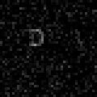
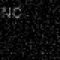
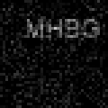
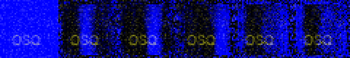
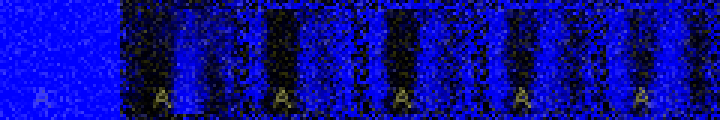
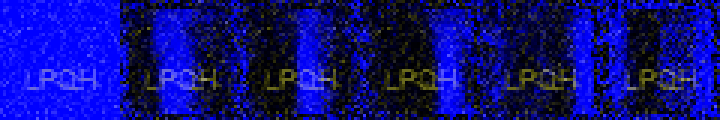
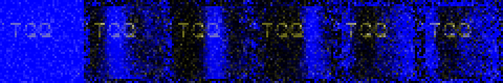

This code is to assess a deep neural network's ability to read text from images, with end-to-end fully differentiable architecture. That is, no bounding box, no preprocessing, just an image and a neural net.

###Details:
1. A text of up to 4 characters is generated and positioned into 40x40 grayscale image, examples below:

2. With batches of 32 images, the training is performed. The architecture of the network includes a recurrent LSTM and attention, as shown on the sketch below

At first, the attention mask is 1. It is multiplied with the input image, and goes through 3 convolutions and then into the LSTM (to remember, where was the last character). The output from LSTM is processed with two separate fully connected layers, one generating a new attention mask, the other one generating a classification.

The training is performed with cross-entropy loss and the outputs after the *terminal symbol* are ignored. The program computes the accuracy as a ratio of completely correctly transcribed words, not individual letters.

3. Performance
The model achieves **87%** accuracy (for whole words) in about 10000 epochs (which takes 5 minutes on nVidia Titan Xp). 

4. Discussion
The model is clearly using the attention mask to select one character at a time, as shown in the images below (blue is the mask):

The text is put into the image with some margin, hence the edges are not important to the model. Interesting fact is that the model selects a whole column, instead of a precise letter location. I'd expect that with larger noise or another image as a background, the model would forced to select more precisely.

###How to run:
You will need python3.6, pytorch 0.4.1 and a GPU. Train with `python3.6 main.py` which will save a `model` file. Explore the results with `python3.6 visualize.py`, which will create several `vis_?.gif` files in the `img` folder.